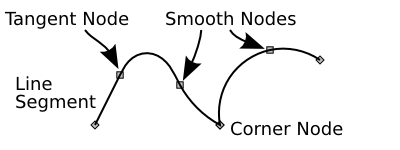

# Inkscape - vector graphic

The easiest way to get a vector graphic is to trace the shape of an existing raster image.

## Tracing

Tracing is done using the tracing tool. The outline of the object must be followed by inserting a spline node whenever the curvature changes. Existing splines can be adjusted if the resulting image is not yet ready.

## Node types

||
| ------------- |
|*http://tavmjong.free.fr/INKSCAPE/MANUAL/html/Paths-LivePathEffects-SpiroSpline.html*|

* Corner node (diamond): The handles of the node are either retracted or not colinear. Sharp corner where the lines move away in whatever direction the neighbouring nodes demand. No restriction on the corner angle is enforced
* Smooth node (square or diamond): The handles of the node are colinear; the rate of curvature is continuous

* Tangent node (square): connects lines and curves. One handle is retracted.

Node types can be changed after creation.

## Exporting

The resulting vector graphics can be exported as an SVG file using the file menu.

## Pitfalls

* Make sure you delete the source image from the project before exporting. Otherwise, Inkscape includes the raster image in the exported SVG, even if it is hidden, leading to a large file size.
