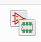
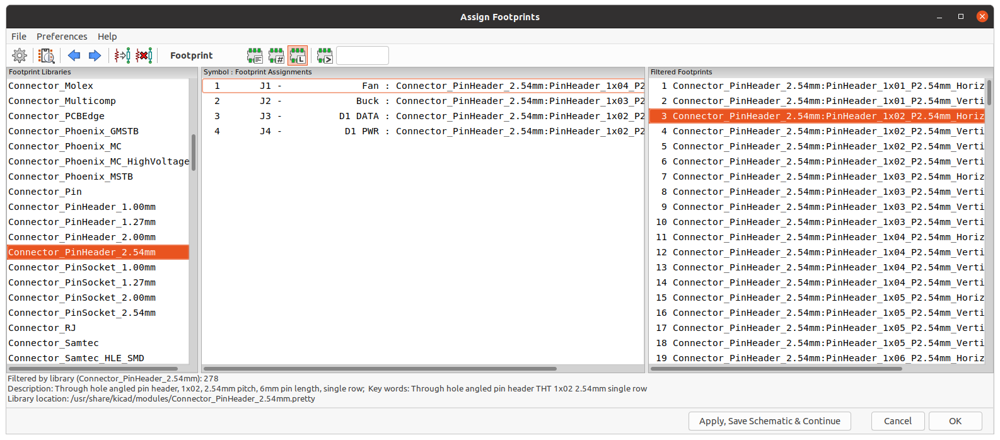

# Assign the footprints

Component footprints are managed separately from the schematic symbols. In this second step, you need to assign a footprint to every component. To do so, open `Tools` > `Assign Footprints` or use the Footprint menu item in the top menu bar.

The opening window displays a list of all your components, along with a list of possible footprints to assign to the components. Select one of your components, find the corresponding footprint and double click it to assign it.

Some common footprints:

| Component | Footprint |
|----|----|
| Resistor | Resistor_THT:R_Axial_DIN0207 (6.3x2.5mm) |
| Any IC | Package_DIP:DIP (any number of pins) |
| Header pin | Connector_PinHeader_2.54mm (any number of pins) |

## Generating the netlist

Use the top menu bar or `Tools` > `Generate netlist file` to generate the netlist and save it into the same folder as the project resides.
