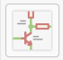
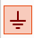

# Creating the schematic

First, you need to create the schematic for the desired PCB. Open the Schema Editor to get started.

Drawing the schema consists of three tasks: placing components, placing power ports and drawing connections. All three items can be selected in the right menu bar or accessed with the keyboard shortcuts A (add component), P (add power port) and W (place wire).

Place Symbol:

Place Power Port:

Place Wire:

As in all other parts of the program, you can also use M (move component), R (rotate component) and DEL (delete component).

Connect all components with wires.

Once you have completed the schematic, add values (i.e. labes) to the components (such as resistor value or capacitor capacity) by hovering the component and pressing V (add value). Move the values to some place where they do not interfere with your work.

Some common components:

| Component | Name |
|----|----|
| Resistor | Device:R |
| Header pin | Connector_Generic:Conn_MMxNN |
| Power input | power:+12V
