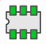
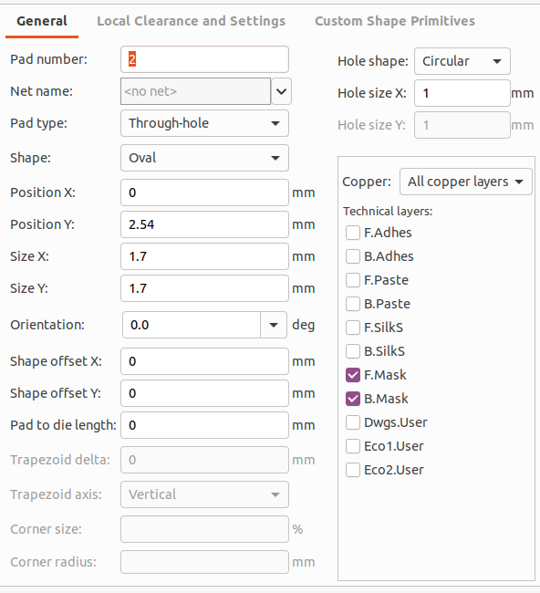
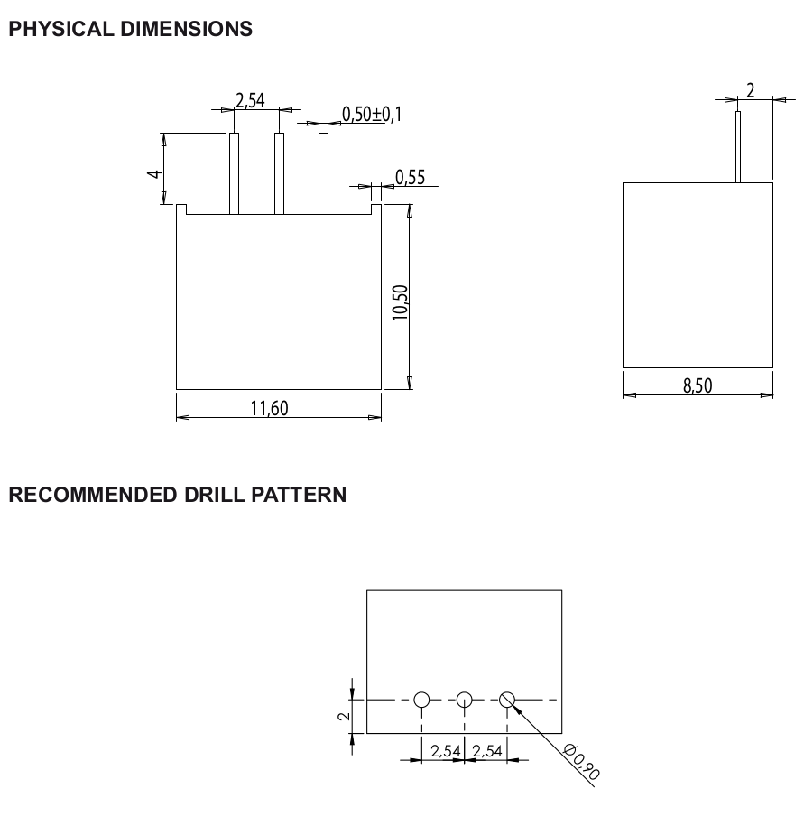

# Custom Footprints

Footprints define the physical size and the pin positions of a component on
the circuit board. They are used to decide spacing and routing.

## Center point

For THT parts, pin 1 is usually used as the center point. For SMD, the center
of the part is usually used.

# Creation

Create a new project or use an existing one. Open the footprint editor

and click `File` > `New Library` to create a new symbol library. Store it in
the project folder and make it local ("Project" table).

Scroll the left panel until you see your library, right click it and select
"New Footprint". Use `WPMDL950005` as the name.

Use the place pad icon to place a new pad. Set the number, position, size, pad
type and shape.

Check other footprints as a reference.

Select the Fab layer and use line tool to draw the outline.

Select the Silk layer and use the line tool to draw an outline around the fab
outline. This helps with placement. Keep the pads clear.

Select the CrtYd layer and use the rectangle or line tool to draw the
courtyard.

According to the dimensions mentioned in the data sheet

the holes should be drilled with a 0.9mm diameter.
