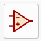
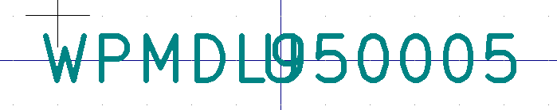
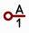
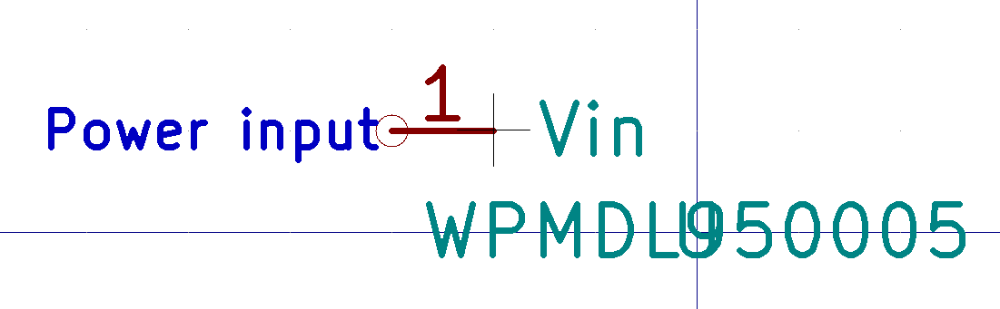
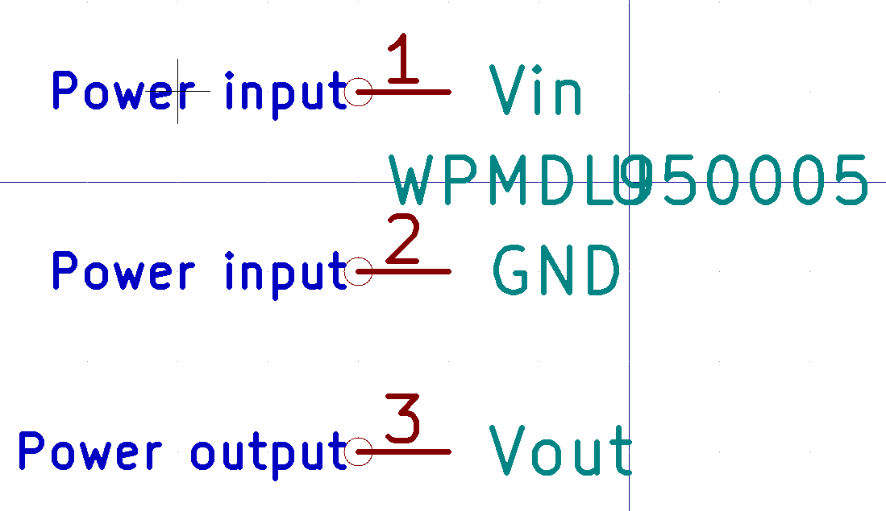

# Custom Symbols

Symbols are a schematic representation of a component that does not necessarily
correspond to the physical properties. For example, the symbol might group pins
with similar functions together while they are far apart in the real component.

It is possible to pre assign a footprint to a symbol. This speeds up usage of
the component.

This chapter will explain how to create a symbol for the `WE78` 5V buck
converter found in [this pdf](images/we78.pdf).

## Pin functions

We first need to find the pin functions. The WE78 has three pins:

* 1: Vin, Power input
* 2: GND, Ground
* 3: Vout, the 5V output

## Electrical type

For every pin, the electrical type must be determined. The following rules
apply:

| Description | Electrical Type |
|---|---|
| Power supplying pins | Power Input |
| Analog and digital input | Input |
| Analog and digital output | Output |
| Bus (SDA of I2C), GPIO | Bidirectional |
| Power supply for other components | Power Output |
| Not Connected | Not Connected |

# Creation

Create a new project for the symbol. Open the symbol editor

and click `File` > `New Library` to create a new symbol library. Store it in
the project folder and make it local ("Project" table).

Scroll the left panel until you see your library, right click it and select
"New Symbol". Name the component as mentioned in the data sheet, e.g.
`WPMDL950005`. Use `U` as the reference prefix.

# Adding pins

Make sure you use the correct grid size. Select `View` > `Grid Settings` to
select 100mil, i.e. 2.54mm.

## Voltage input

Use the place pin icon (Shortcut: P) in the right sidebar. Set the name to
`Vin`, the pin number to 1, the electrical type to "Power Input" and the pin
length to 100mil.

## Ground

Repeat the above step, using GND as the pin name, 2 for the number, and
"Power Input" as the electrical type.

## Voltage output

Repeat the above step, using Vout as the pin name, 3 for the number, and
"Power Output" as the electrical type.

# Outline

Change the grid spacing to 50mil for the outline.

The outline should be drawn so that the end of the pin (the one without a
circle) touches the outline, and the circled end points outwards.

Select the rectangle tool from the right sidebar and draw a rectangle. You can
fill it by right clicking it and editing the properties.

Move the reference and value fields outide the outline with the M shortcut.

# Additional information

Open the symbol properties dialog (`Edit` > `Properties`) to add additional
information. Select an existing footprint if possible.
