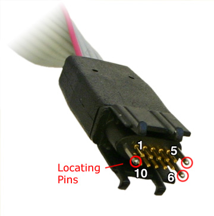
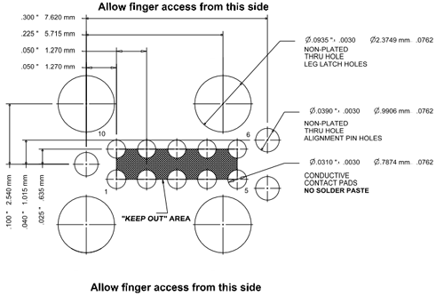

# Programmer and debugger ports

## Debugging

Adding a debugger port allows programmers to set breakpoints, step through the
running code and flash new bootloader and firmware binaries onto the device.

There are two debug protocols: JTAG and SWD. JTAG uses 20 pins, and is able to
power the MCU directly from the debugger. Additionally, it allows access to
more signals provided by the MCU. SWD uses 4 to 6 pins and only supports the
slightly more limited SWD protocol.

For simplicity, only the SWD interface is explained here.

### 6 vs 10 vs 20 pin connectors

The number of connectors is a tradeoff between connector size and feature
richness of the debugger. Generally, the following (dis-)advantages exist:

* 6 pin: SWD only, very little space required, no connector required.
* 10 pin: SWD and JTAG, little space required, no connector required, able to power target.
* 20 pin: ???

### SWD interface

ARM processors usually use the SWD (Serial Wire Debug) interface. It consists
of the following pins:

| Pin | Type | Description |
|---|---|---|
| VREF | Output | Target voltage |
| SWDIO | Bidirectional | Data pin |
| SWCLK | Output | Clock signal |
| GND | - | Ground level |
| SWO | Output | Optional: trace output |

## Debug probes

Many debug probes are available. The following information is for the Black
Magic Probe.

The connector pins are laid out as follows (the names in brackets are the
configuration of the nrf9160 DK). Only VTREF, SWDIO, SWCLK and GND are
required. The signals TMS/TCK/TDO/TDI are from the JTAG standard and are not
required for SWD debugging.

| Notch | Column 1 | Column 2 |
|---|---|---|
| | 1 VTREF | 2 SWDIO/TMS |
| | 3 GND | 4 SWCLK/TCK |
| [ | 5 GND | 6 SWO/TDO |
| | 7 NC | 8 TDI/(NC) |
| | 9 NC/(GND) | 10 nRESET |

There is a 6 pin version available with the following pin functions (⦻ is for
the alignment hole). A 10-pin-to-6-pin adapter is required.

<table>
  <tr><th>Column 1</th><th>Column 2</th></tr>
  <tr><td align="center" colspan="2">⦻</td></tr>
  <tr><td>1 VTREF</td><td>2 SWDIO</td></tr>
  <tr><td>3 nRESET</td><td>4 SWCLK</td></tr>
  <tr><td>5 GND</td><td>6 SWO</td></tr>
  <tr><td align="center">⦻</td><td align="center">⦻</td></tr>
</table>

## Debug connectors

The debugger can be connected to the target in multiple ways:

* Placing a header with pins on the board: easy to solder, uses much space.
* Exposing the copper of the SWD traces on the board, along with alignment and
latch holes, to be used with a needle adapter: no soldering, easy to attach the
adapter.
* Exposing the copper of the SWD traces with alignment holes for a needle
adapter _without_ leg latches: no soldering, adapter must be pushed down on the
board manually.

The options are explained below.

### Header

Use a 2x5 pin header with 1.27mm connector spacing on the board. You can
optionally use a one-way shroud to ensure the connector is plugged in the right
way.

### Needle adapter with latches

The nrf9160 DK uses exposed pads compatible with the "TC2050-IDC" connector.

### Needle adapter without latches

The option without latches does not require the latch holes of the above
drawing. This makes the footprint a lot smaller, but might not be equally
convenient.

This option is compatible with the "TC2030-IDC-NL" connector.
