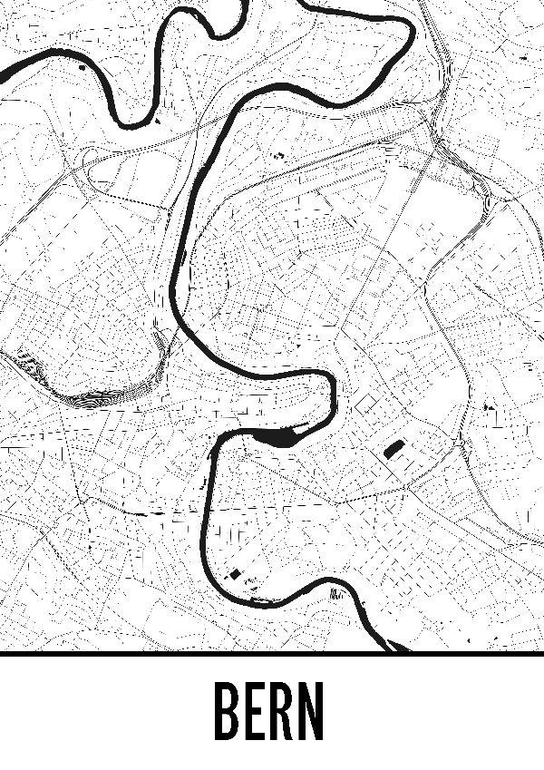
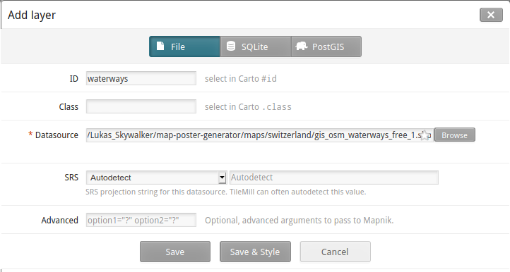
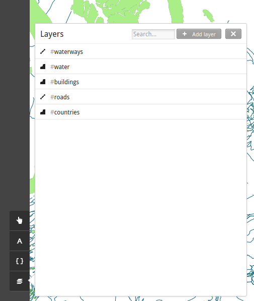
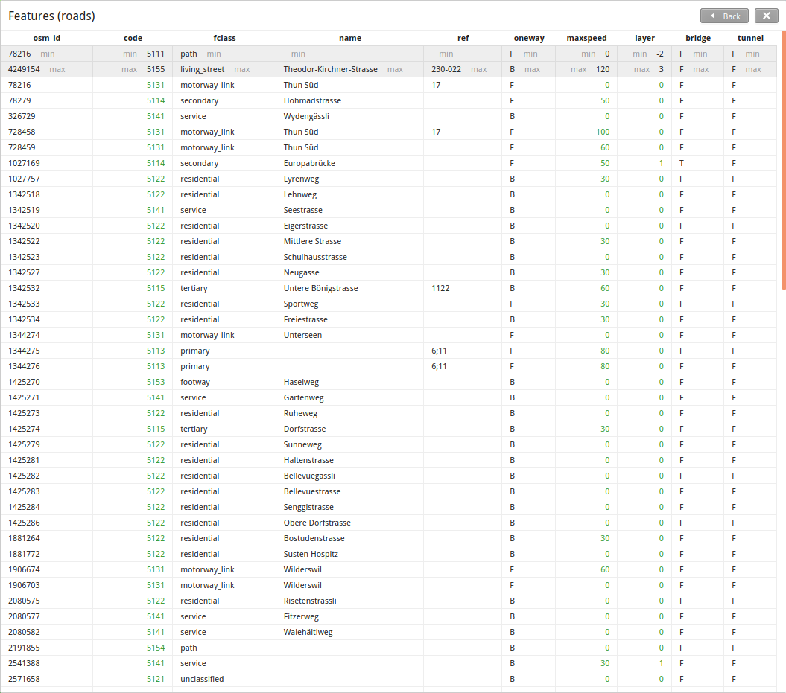
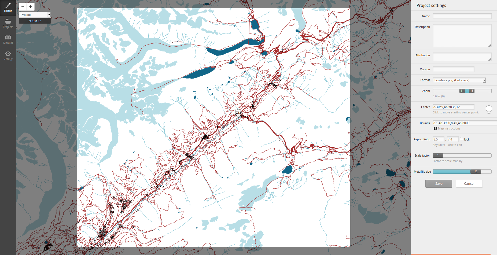

# TileMill

## Intro

Tilemill is an open source map design software. It can import GIS data
from various sources and lets you design a map based on said data.
Tilemill was primarily created for exporting MBTiles-formatted raster
images, but can also be used to export single SVG, PDF or raster
images. Styling is achieved with CartoCSS, a css-like language which
allows users to describe what features should be displayed at what zoom
level in what appearance.

This guide explains how to create a poster similar to the following
image.



## Installation

Download and install TileMill according to the instructions on the
[website](https://tilemill-project.github.io/).

## GIS data

The easiest way to acquire vector map data is to download them from
a German company named [Geofabrik](https://www.geofabrik.de/). They
have a [download page](http://download.geofabrik.de/) where you can
download .shp files for various regions of earth. Download the
appropriate region and unpack it.
The zip folder contains shapefiles for various different features, like
water areas, roads and buildings.

## Importing layers

* Start and open TileMill in the browser (using `npm start`).
* Create a new project on the welcome screen. This creates a new
  project where one layer, containing the shapes of all countries, is
  imported.
* Add a new layer by clicking the layer icon and "Add Layer".
* Your layer must be identifiable by ID or class. It is easiest to give
  the layer an ID describing the content of the shapefile, e.g. "roads"
  if you choose to import the shapefile of the roads.
* Select the Shapefile as the datasource and leave all other options as
  they are. Click "Save & Style".



## Styling layers

The layer view should now display all the layers you imported. You can
toggle their visibility, delete them or list all contained objects in
the layer panel.



The different objects of a layer are usually tagged. The tags contain
information about the road size, the maximum speed, the water depth and
much more. Those attributes can be used to style different types of
objects of the same layer differently. To see all possible attributes
and their values, hover the layer and open the "Features" view. The
table lists all attributes, e.g. `fclass` for the road size.



To style a layer, you can enter CartoCSS code in the right pane of
TileMill. CartoCSS works like normal CSS, where you can target the
attributes of features with the CSS attribute selector:

```css
Map {
  background-color: white;
}

@color: rgb(0, 66, 138);

#roads{
  line-width: 1;
  line-color: transparent;
}
#roads[fclass = "motorway"] {
  line-width: 3;
  line-color: @color;
}
```

This CartoCSS code hides all roads, but overrides the color for all
roads with the `fclass` attribute of `motorway`. The file
[style.mss](images/style.mss) contains a complete example.

## Exporting

In order to export the map SVG, you must first find the zoom level to
export. Open the settings in the top right and zoom all the way out.
Then start zooming in on the required area one level at a time. Make
sure to wait until the map has loaded until you zoom further. This
could take some time.

Once you have reached your desired zoom level, you need to define the
map extent. Shift-drag to set the map extent. Save the settings once
you are happy.



Click the export button on the top right, and choose the format, size,
zoom level and bounds of your export. Make sure the size corresponds
to the pixel size of your final poster (e.g. 7016 x 9933px for printing
an A1 poster. Then export the file as SVG.

## Labelling

The easiest way to add the location label is to open the resulting SVG
file in [Inkscape](../inkscape/README.md) and copy an existing
template. You can download a template of the
[finished poster](images/bern_poster.svg). The original poster uses the
"Equal Sans" font by [Måns Grebäck](https://www.mansgreback.com/) which
is free for noncommercial use. You can [download](images/EqualSans_Demo.ttf)
it from this repo.
