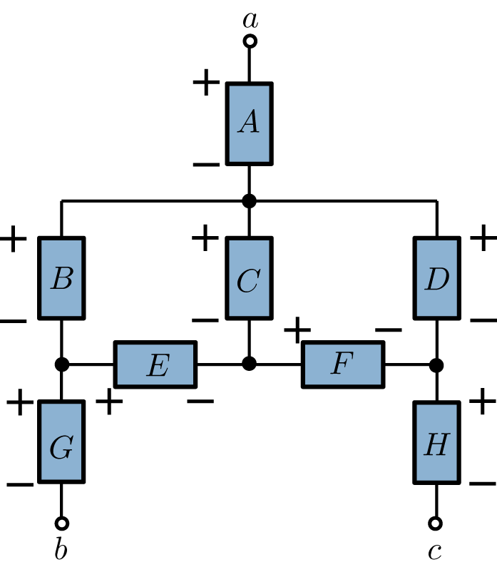

# DC Analysis

## Charge and current

### Intro

Current: rate at which charge flows
Charge: (Coulomb, q or Q)
may be positive: 1.602E-19 or negative: -1.602E-19

Particles exert force on other charged particles. Force per unit is called electric field.
The electric field points away from + and towards -.

Current I = Quantity of charge Q passing through given area in specified time t

i(t) = dQ(t)/dt

For constant current: I = Q/t
1A = 1C/s

### Examples

* 50C of charge flow through a 1mm wire in 2 seconds. How much current flew through the wire?
  * I = Q / t = 50C / 2s = 25A
* A charge of Q(t) = 4t²+5 is flowing through a wire of 1mm. How much current flows in 6 seconds?
  * I(t) = dQ(t)/dt = 8t = 48A
* I(t) = {
  0 < t < 10s: -t/10 + 1A
  t > 10s: 0
}; how much charge in the first 5s?
  * i(t) = dQ(t)/dt => Q(t) = Integral(-t/10+1)
  * Integral(-t/10+1) = t - (t² / 20) + k = 5 - (25/20) + k = 5 - 5/4 = 15/4 C

### Current direction

+ -> -: positive current flow (x A)
- -> +: negative current flow (-x A)

### Examples 2

* A cap holds a charge of 2 micro C. A current of 3A flows through it for 2 micro seconds. What charge now?
  * I = Q / t => Q = I * t = 3A * 0.000002 = 6 micro C
* Current through a terminal is i = 4t³-3t² A. How much charge enters the terminal between t = 1 and t = 3?
  * Q(t) = Integral 1..3(4t³-3t²) = 54C
* Current through element i(t) = {
  0 < t < 0.5: 5A
  t > 0.5: 3t²A
}; how much charge from t = 0 to 1?
  * q1: I = Q / t <=> Q = I * t = 5 * 0.5 = 2.5C
  * q2: I(t) = dQ/dt => Q = Integral 0.5..1(3t²) = 0.875C
  * q1+q2 = 3.375C

## Voltage

### Intro

Charge loses or gains energy when moving through field

* Loss when moving with field lines (+ -> -) (negative)
* Gain when moving against field lines (- -> +) (positive)

Voltage: change in energy (w, Joule) per coulomb (q, Coulomb) of charge

V = dw/dq

V = energy / charge [J/C]

Voltages are measured from + to -.

### Examples

* 4C of charge lose 20J of energy when moving in a field. What's the voltage v from high to low?
  * 20J/4C = 5V -> energy loss
* 21J of energy are required to move 3C through a field from low to high. What is the voltage?
  * 21J/3C = -7V -> energy gain

## Reference

Voltage measurements are relative. Require reference point. They add up, so a gain of 5V and a drop of -3V result in a net gain of 2V.

## Examples 2

* A PSU supplies 4A for 6.5s to a light bulb. The radiated energy is 2.99kJ. What's the voltage drop?
  * I = Q / t => Q = I * t = 4 * 6.5 = 26
  * V = w / Q = 2990 / 26 = 115V

* vA​=3
* vD=1
* ​vE=2
* ​vG​=2
* vH=-2
* ​vab​=1

Find vC:
  * vC = vB+vE
  * vB = (vab - vG - vA) = 1 - 2 - 3 = -4
  * vC = -4 + 2 = -2

Find vac:
  * vac = vA + vD + vH = 3 + 1 - 2 = 2

Find vF:​
  * vF = -vC + vD
  * vC = -2
  * vF = 2 + 1 = 3

## Power & Energy

Power (p, in Watt) is the rate of the energy change of the charge over time:

p = dw / dt = dw/dq * dq/dt = v * i

Negative Power (i < 0 or v < 0): Generated

Positive Power (i > 0 and v > 0): Consumed

### Examples

* i1 (+ to -) = 5A, v1 = 2V, p1?
  * p1 = v1 * i1 = 10W, consumed
* i2 (- to +) = 4A, v2 = 3V, p2?
  * p2 = v1 * -i1 = -12A, generated
* p(t) = sin(100t), w(t) = ?
  * w(t) = Integrate(p(t)) = -1/100*cos(t)

The sum of power generated and consumed in a system is 0.

### Examples 2

* I(- to +) = 5A, V = 10V, P?, gen/cons?
  * P = v * i = -50W, gen
* t = 4ms, i = 7 * cos(60) * pi * t, v = 4i, P?
  * v = 4i = 28 * cos(60) * pi * t
  * p = v * i = 112 * cos²(60) * pi * t = 0.351
* 50W bulb, energy consumption in 4h?
  * 4h = 3600s * 4h = 14400s
  * p = dw/dt => w = p * t = 50 * 14400 = 720000J = 720kJ

## Resistance & Ohm's Law

Charged particles encounter resistance when flowing

Resistance determined by area A, length L and resistivity rho.

R = rho * L / A

Conductance G = how a material allows to flow

G = 1 / R

Conductibity sigma = 1 / rho [A/V, siemens]

### Examples

* Length 1m, area 0.001m², rho 2*10⁻⁸, resistance?
  * R = rho * L / A = 2 * 10⁻⁵ Ohm
* Double area, how does R change?
  * 1/2 resistance

## Ohm's Law

Voltage produced in current flow is proportional to resistance R

V = i * R

### Examples 2

* What is P in Watt if V = 0.5V and I = 2A?
  * P = V * I = 1W
* 100W lightbulb, 120V PSU. Find I.
  * P = U * I => I = P / V = 100/120 = 0.833A
* Resistor with l=1mm, A=4mm², rho=20o. Resistance?
  * R = rho * L / A = 20000 * 0.001 / 4*10⁻⁶

## Circuits

Node: any point on circuit where two or more elements meet, i.e. areas with different voltages

Junction: point where wires meet

--> any node may have several junctions!

Short: wire with same start and end node as another element

Open: Terminals, that are no connected to any other element -> no current flow
