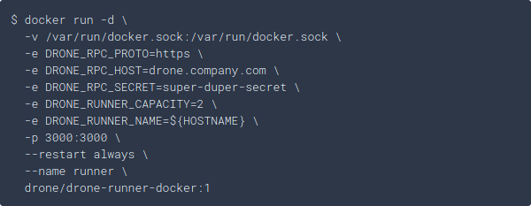

# Drone Runner

For the runner, follow the same steps as fot the server, but make sure you
follow the instructions for the
[runners](https://docs.drone.io/runner/docker/installation/linux/).

The instructions state that

* the runner requires the file `/var/run/docker.sock` to be mounted
* it listens on port 3000

## Preparing dokku and the image

* Create a dokku app: `dokku apps:create drone-runner`
* Pull the Docker image: `drone/drone-runner-docker:1.5.2`

## Set the env variables

Set all the env variables mentioned in the [documentation])(https://docs.drone.io/runner/docker/installation/linux/).

* `dokku config:set drone-runner DRONE_RUNNER_CAPACITY=2`
* `dokku config:set drone-runner DRONE_RUNNER_NAME=cloud0`
...

## Mount a persistend host directory

* `dokku storage:mount drone-runner /var/run/docker.sock:/var/run/docker.sock`

## Change port mapping

* `dokku proxy:ports-add drone-runner http:3000:3000`

## Deploy the image

Run `dokku git:from-image drone-runner drone/drone-runner-docker:1.5.2`
