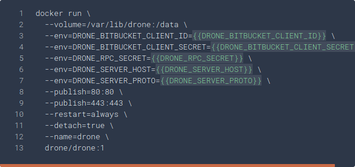

# Drone

To get started with Drone, read the
[documentation](https://docs.drone.io/server/provider/bitbucket-cloud/), where
you can find the following snippet:

It states the following:

* Drone is based on the Docker image `drone/drone:1.9.1`
* It is run via `docker run`, where you need to pass various env variables
* It listens on port 80

## Preparing dokku and the image

* Create a dokku app: `dokku apps:create drone-server`
* Pull the Docker image: `docker pull drone/drone:1.9.1`

## Set the env variables

Set all the env variables mentioned in the [documentation])(https://docs.drone.io/server/provider/bitbucket-cloud/).

* `dokku config:set drone-server DRONE_BITBUCKET_CLIENT_ID=1234`
* `dokku config:set drone-server DRONE_BITBUCKET_CLIENT_SECRET=abcdef`
...

Careful!
Make sure you disable the HTTPS redirect option. Dokku terminates the SSL
connection with Nginx and internally proxies requests to the container by HTTP.
This makes Drone believe an HTTP request arrived and it issues a redirect to
HTTPS, resulting in an infinite loop.

## Mount a persistend host directory

* `dokku storage:mount drone-server /var/lib/dokku/data/storage/drone-server:/data`

## Change port mapping

* `dokku proxy:ports-add drone-server http:80:80`

## Deploy the image

Run `dokku git:from-image drone-server drone/drone:1.9.1`
