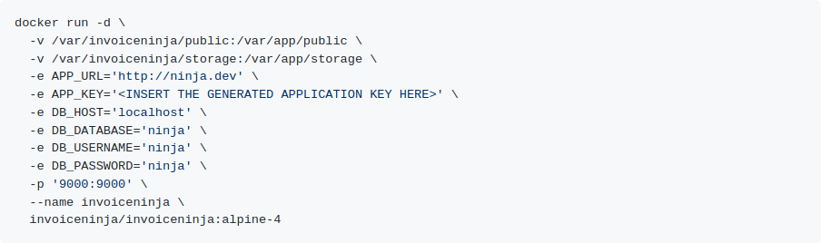

# Invoice Ninja

## Preparation

* Create a dokku app: `dokku apps:create invoiceninja`
* Pull the Docker image: `docker pull codefabrikgmbh/invoiceninja:latest`

Note: The original invoiceninja/latest image can be run on Dokku. It includes
only php-fpm as the base image though. Because this image lacks a web server,
the default Dokku Nginx reverse proxy configuration does not work. To make it
work on Dokku, it is necessary to either modify the Dokku reverse proxy to pass
requests to php-fpm by `fastcgi_pass` or to create an image containing both the
Invoiceninja app and an Nginx web server (with `fastcgi_pass` as well). The
image
[dockerfiles/invoiceninja](https://github.com/code-fabrik/dockerfiles/tree/master/invoiceninja)
follows the seconds approach and combines the IN image with an Nginx web
server.

## Services

In the [instructions](https://github.com/invoiceninja/dockerfiles/wiki/docker-only-setup)
for IN, you can find the `docker run` command to start a container. You can see
the following:



* Two mounted volumes to store persistent files
* MySQL for storing the data
* A secret key
* PHP-FPM will listen on port 9000

Install the required plugins and create the services:

```bash
dokku mysql:create invoiceninja-mysql
dokku postgres:link invoiceninja-mysql invoiceninja
```

To get persistent storage volumes, mount the folders:

```bash
dokku storage:mount sentry /var/lib/dokku/data/storage/invoiceninja/public:/var/invoiceninja/public
dokku storage:mount sentry /var/lib/dokku/data/storage/invoiceninja/storage:/var/invoiceninja/storage
```

According to the docs, those folders must be owned by the correct user, since
the user inside the container is not root:

```bash
chown -R 1000:82 /var/lib/dokku/data/storage/invoiceninja/public
chown -R 1000:82 /var/lib/dokku/data/storage/invoiceninja/storage
```

## Config

To continue, you need to check out the documentation of the image you want to
deploy to see what configuration or env variables need to be set. For IN, the
following env variables are required:

* APP_URL, the URL the application uses for redirects and links
* APP_KEY, which you can generate with `docker run --rm -it invoiceninja/invoiceninja php artisan key:generate --show`
* DB_HOST, DB_DATABASE, DB_USERNAME and DB_PASSWORD, which you can get from `dokku mysql:info invoiceninja-mysql`

There are [additional optional variables](https://github.com/invoiceninja/invoiceninja/blob/master/.env.example)
you can set to configure emails and other external services.

## Add proxy settings

`dokku proxy:ports-add invoiceninja http:80:9000`

## Deploy

Run `dokku git:from-image invoiceninja codefabrikgmbh/invoiceninja:latest`
