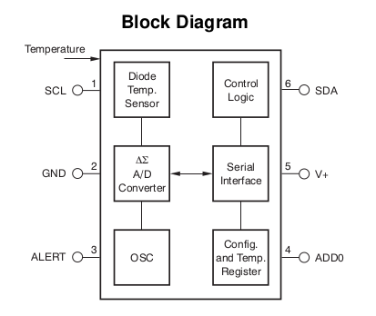
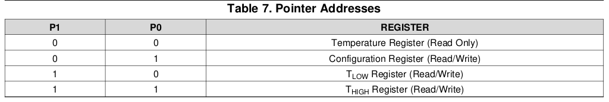
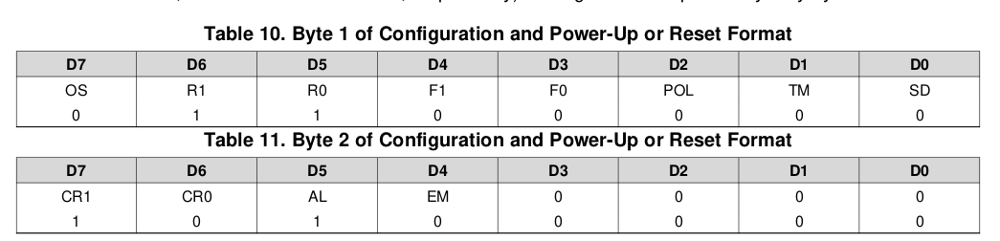

# TMP102 temperature sensor

## Requirements

* [I2C](../../protocols/i2c.md)

The TMP102 is a 6 pin chip capable of measuring the temperature. It has three
modes of communication: SMBus, Two-Wire and I2C. This manual will use the I2C
interface.

## Pins

* SCL: Serial clock, used for I2C. Connected to the &mu;C SCL
* SDA: Serial data, used for I2C. Connected to the &mu;C SCL
* ALERT: over temperature alert output
* ADD0: address select, connect to GND or V+

## Registers

The temperature is stored in a either 12 bit or 13 bit read only register,
depending on whether *Extended Mode* was activated. Byte 1 is the MSB, Byte 2
is the LSB. 1 bit equals 0.0625°, while negative numbers are stored as twos
complement. The bit D0 of byte 2 indicates *Normal* (0) or *Extended Mode* (1).

Example: a register value of `0011 0010 0000` indicates a temperature of `50°`
since `0b0011 0010 0000` = `800` and `800 * 0.0625 = 50`.

If the MSB is 1, the temperature is negative. A register value of
`1110 0111 0000` indicates a temperature of `-25°`, because the twos complement
of `0b1110 0111 0000` is `0b0001 1001 0000` (formed by inverting all bits and
adding `1`). This is the absolute value of the temperature. Convert to decimal
and add a negative sign. This gives `-400 (dec)`, which can be multiplied by the
above resolution to get `-25`.

## Bus address (ADD0)

Depending on how the `ADD0` pin is connected, the bus address of the sensor
changes:

## Reading and writing

To access a register, the master must write the register address to the pointer
register, which is indicated by the first byte transferred after the address
byte, while keeping the R/W bit low to indicate a write.

To read the register at the address in the pointer register, a START condition,
the slave address and the R/W bit high starts a read operation. This can also
be used to issue repeated read commands.

## Device modes

### Conversion mode (CR0 and CR1)

Default. Temperature is measured continually, then converted and stored in the
temperature register. The bits CR0 and CR1 configure the conversion rate.

### Shutdown mode (SD)

SD bit set to 1 enables the shutdown mode.

### One shot (OS)

When the device is in shutdown mode, writing a 1 to the OS starts a single
temperature conversion.

## Common actions

The pointer register uses the two LSB to decide which of the data registers
must respond to the command.

### Temperature reading

To read the temperature, one needs to perform the following steps:

* Write the register address of the temp register to the pointer register. This
means sending a command which contains
  * an address frame made of
    * the devices 7 bit address
    * the bit 1 to indicate a writing command
  * a data frame made of
    * 6 0-bits
    * the register bits `0b00` as defined in Table 7
* Receive the two temperature bytes off the SDA line, which consist of
  * the MSB containing bits 11:4
  * the LSB containing bits 3:0 and 4 padding 0 bits.

### Shutting down

To shut the device down, one needs to first read the configuration register and
then write an update value using the following steps:

* Write the register address of the config register to the pointer register:
  * an address frame made of the devices 7 bit address and the bit 1 to
  indicate a reading command
  * a data frame made of 6 0-bits and the bits `0b01` as defined in Table 7
* Receive the two configuration bytes of the SDA line as defined in Table 10
* Write the register address of the config register to the pointer register:
  * an address frame made of the devices 7 bit address and the bit 1 to
  indicate a writing command
  * a data frame made of 6 0-bits and the bits `0b01` as defined in Table 7
  * a data frame (as MSB) set to `0x00000001`
  * a data frame (as LSB) set to `0x00000000`
