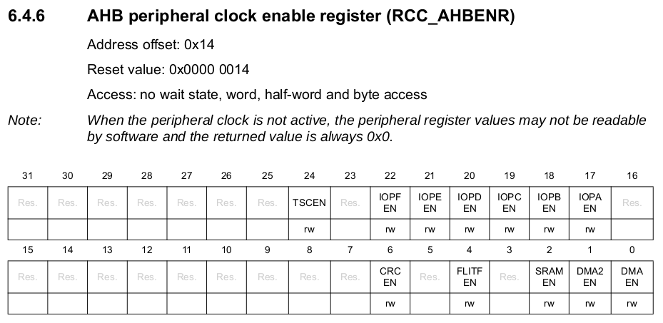
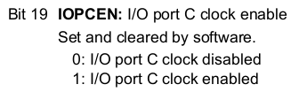
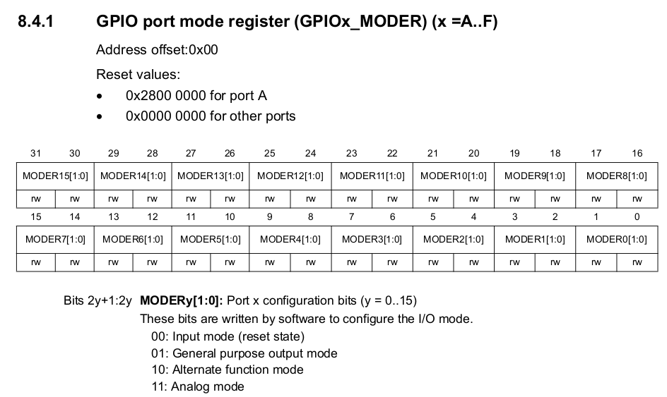

# STM32 Blink

## Overview

The STM32 typically contains multiple (6) GPIO ports, connected to separate clocks. 

To use any GPIO pin as an output, the following actions must be performed:

* The peripherial clock must be enabled
* The pin must be configured as an output
* A value must be written to the pin's register

## Programming

### Enabling the peripherial clock

Let's assume that Pin 13 should be used to blink an LED.

TODO: how to get GPIO port for specific pin?

Pin 13 is connected to the GPIO C port. To enable the peripherial clock for the
C port, the clock must be enabled by writing a 1 to the corresponding address of
the clock enable register.




According to the datasheet, to enable GPIO port C, the bit 19 must be enabled.
Since only full registers can be written, the easiest way to enable bit 19 is
to perform a bitwise OR operation with the current register values. In
pseudo code, this would look like this:

```ruby
RCC_AHBENR |= 00000000000010000000000000000000
```

To simplify, one can write the corresponding hexadecimal value:

```ruby
RCC_AHBENR |= 0x00080000
```

or even shorter:

```ruby
RCC_AHBENR |= 0x80000
```

### Putting the pin into output mode

Pins can be configured in four different modes and can either work in analog or
digital mode.



To put pin 13 into output mode, the bits 01 must be written to the GPIOC_MODER
registers at address 27 and 26. Using the same logic as above, this could be
written as (since bits 27:24 must be 0100, they are written as 0x4 in hex):

```ruby
GPIOC_MODER |= 0x04000000
```
